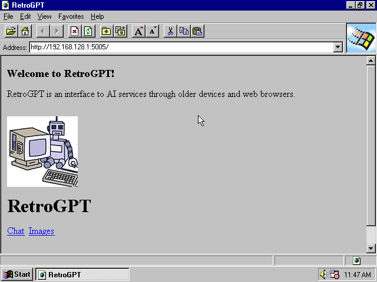

# RetroGPT - The IE 3 Compatible ChatGPT Client.


RetroGPT is a wrapper around the OpenAIs APIs, allowing us to access them on older web browsers and computers. You can throw away your "MSDOS for Dummies" books; now you can ask ChatGPT how to edit your Autoexec.bat and finally get your SoundBlaster 16 working on your 486, all while nestled in your comfort zone of Windows 3.11 for Workgroups.



RetroGPT is optimized for early to mid-90s web browsers. It should work on most versions of Netscape, Internet Explorer, Opera, and others. The ChatGPT sessions are structured with basic HTML table layouts. The DALL·E 2 images, the raw image is downloaded to a cache on your computer, and a downconverted GIF is sent in its place.

## Setup

You can download a compiled version of RetroGPT from the Released Packages here on GitHub.

In order to use RetroGPT, you must edit the included `APITokens.json` file and include your OpenAI Tokens. To get those tokens:

- [Login to the OpenAI site](https://platform.openai.com/account/api-keys), and create a new secret key.
- [Copy your Organization ID](https://platform.openai.com/account/org-settings)

```json
{
  "OpenAIServiceOptions": {
    "ApiKey": "{SECRET KEY}",
    "Organization": "{ORGANIZATION ID}"
  }
}
```

- Next, run `RetroGPT`. It will start the server. You can connect to it via `http://localhost:5005` on your computer, or on your local area nextwork by using the IP Address of the computer you're running the server on.

## Note:

- On Linux and macOS, you may need to make `RetroGPT` executable. To do this, run `chmod a+x RetroGPT` in the RetroGPT directory. Then run `./RetroGPT`

# Compile

RetroGPT is an ASP.NET Core Program. To compile:

- Clone this repository
- Install the [.NET 7 or later](https://dotnet.microsoft.com/en-us/download/dotnet) SDK
- From the `src` directory, run `dotnet build` and `dotnet run`.
